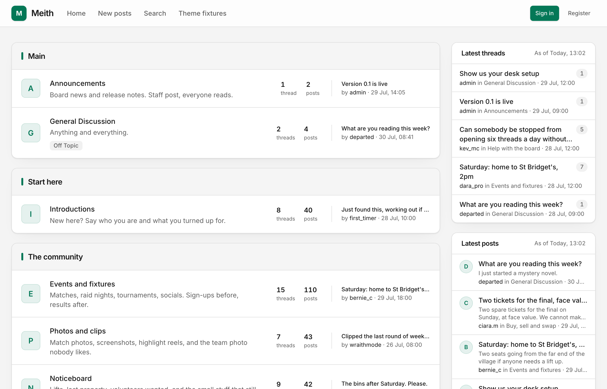
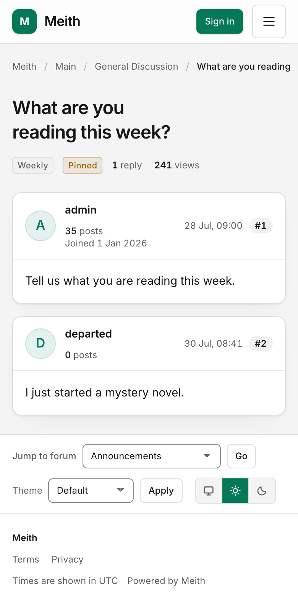

<h1>
  <picture>
    <source media="(prefers-color-scheme: dark)" srcset="./apps/web/public/wordmark-dark.svg">
    <source media="(prefers-color-scheme: light)" srcset="./apps/web/public/wordmark-light.svg">
    
  </picture>
</h1>

**Open-source, self-hosted forum software.**

Meith gives your community a board on your domain, with a PostgreSQL database
you control. Discussions, search, moderation, themes and plugins are included.
Most reading and posting works with JavaScript switched off.

[Get started ↗](./docs/start/quickstart.md) ·
[Documentation ↗](./docs/README.md) ·
[meith.dev ↗](https://www.meith.dev) ·
[Community ↗](https://forum.meith.dev)

<picture>
  <source media="(prefers-color-scheme: dark)" srcset="./apps/web/public/shots/theme-default-dark.png">
  <source media="(prefers-color-scheme: light)" srcset="./apps/web/public/shots/theme-default-light.png">
  
</picture>

The Default theme on a desktop, using sample data. Images follow your light or dark scheme.

## Try it locally

You need **Node.js 22 or newer**.

```sh
npx create-meith my-board
cd my-board
npm install
npm run dev
```

Open <http://localhost:3000>. The preview uses sample data, with no database or
Docker required. It does not save posts or create accounts. To start writing,
[connect a local PostgreSQL database](./docs/operations/local-board.md).

## What’s included

- **Discussions and search.** Forums, threads, polls, attachments and full-text
  search, with results limited to content each member can access.
- **Moderation.** Content approval, reports, warnings and bans, with permissions
  for the people looking after each forum.
- **Themes and plugins.** Change the board’s appearance or add features through
  documented extension points. Themes support light and dark schemes.
- **Member tools.** Profiles, private messages, notifications and subscriptions
  to threads and forums.
- **Operations.** An operator CLI for backups, restores, imports and upgrades.
  Bring an existing community across from MyBB or phpBB.

<details>
  <summary>See a thread on a phone</summary>

<p>The same board in the Default theme, with posts in the order they were written.</p>

<picture>
  <source media="(prefers-color-scheme: dark)" srcset="./apps/web/public/shots/thread-mobile-dark.png">
  <source media="(prefers-color-scheme: light)" srcset="./apps/web/public/shots/thread-mobile-light.png">
  
</picture>

</details>

## Run a board

Meith is [MIT licensed](./LICENSE.md), with no licence fee or per-member pricing.
You arrange the domain and hosting. A live board needs PostgreSQL, persistent
upload storage, email delivery and scheduled tasks.

[Choose a deployment](./docs/operations/deployment.md) using Coolify, Docker
Compose or Vercel, then follow the
[community setup checklist](./docs/administration/first-steps.md). The
[operations guide](./docs/operations/operating.md) covers ongoing maintenance.

Moving from MyBB or phpBB? Read the [migration guide](./docs/operations/migrating.md)
for supported data, limitations and a rehearsal before cutover.

## Make it yours

Start with [theme development](./docs/extensions/themes.md) or
[write your first plugin](./docs/extensions/first-plugin.md). To connect another
application, use the [API quickstart](./docs/integrations/api-quickstart.md).

## Contribute

To work on Meith itself, you need **Node.js 22 or newer** and **pnpm 10**.

```sh
git clone https://github.com/meith-dev/meith.git
cd meith
pnpm install
pnpm dev
```

The board opens at <http://localhost:3000> with sample data. The
[development guide](./docs/contributing/development.md) covers database setup,
the workspace and tests. Follow [AGENTS.md](./AGENTS.md) and run `pnpm verify`
and `pnpm comments:check` before submitting a pull request.

[Report a problem](https://github.com/meith-dev/meith/issues) or join the
[community board](https://forum.meith.dev) to discuss a change.

## Licence

[MIT](./LICENSE.md). Copyright © 2026 Jordan Harrison and the Meith contributors.
