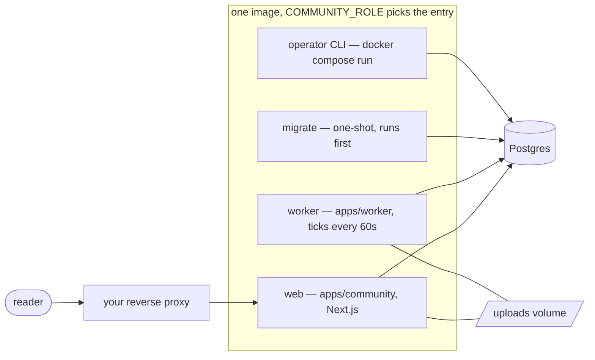
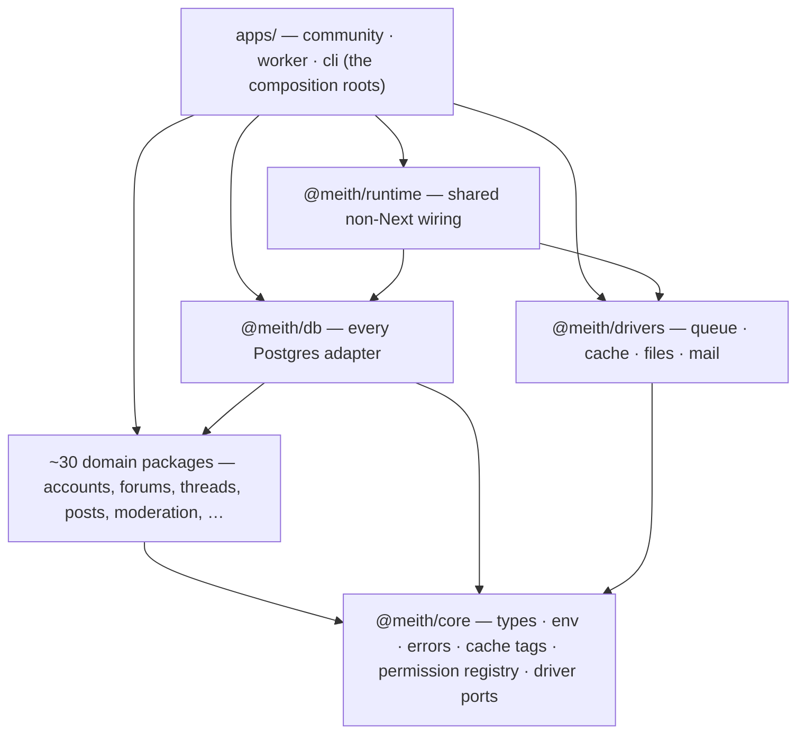
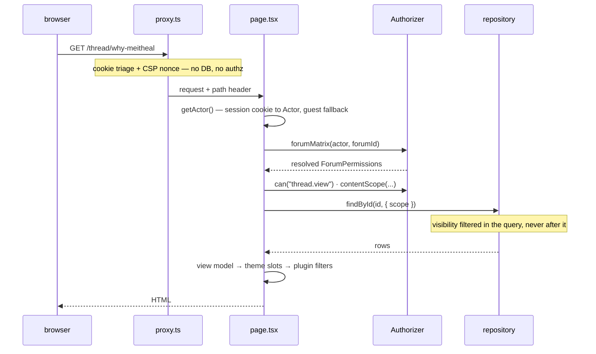

# Architecture

How Meith fits together: the processes it runs as, the layers the code is cut
into, the path a request takes, and the seams — data, themes, plugins — that
everything else hangs off. It is the companion to
[Development](./development.md) for people working on Meith itself; you do not
need any of it to run a board.

Two design decisions explain most of what follows:

- **Domain logic is framework-free.** Business rules live in packages that
  import neither Next.js nor a SQL client. They see repository interfaces, not
  implementations, which is why the same code runs in a web request, the
  worker, the CLI and a unit test without a database.
- **The boundaries are checked, not trusted.** Every layering rule below is a
  hard error in CI: dependency-cruiser for imports, textual guards for
  invariants a type cannot express, and a probe for each guard proving it
  still fires.

## The processes

A running board is one Docker image started three ways — `COMMUNITY_ROLE`
selects the entry in [`docker/entrypoint.sh`](../docker/entrypoint.sh) — plus
Postgres:

The compose files ([`docker/compose.yml`](../docker/compose.yml) and the
Coolify variant) encode the dependency order: `migrate` waits for Postgres to
be healthy, and `web` and `worker` wait for `migrate` to exit successfully, so
the code never serves against a schema behind it. The `uploads` volume is
mounted read-write into both `web` and `worker` because avatars, attachments
and the board logo share one file store.

This shape is what the README means when it says serverless is a non-starter.
A board needs three things a function cannot provide: a scheduler that fires
every minute (the worker, or a cron calling `GET /api/system/tick`), a disk
that survives restarts (the volume, or S3), and a process that outlives a
request (the queue drain).

Two deployments deviate from this shape on purpose:

- **[Demo mode](./demo-mode.md)** runs no worker. Its compose file
  ([`docker/compose.demo.coolify.yml`](../docker/compose.demo.coolify.yml))
  replaces it with a `ticker` service that calls `/api/system/tick` on the web
  container, because the demo's reset task must invalidate a cache that lives
  in the web server's own process. It also carries no volumes, and replaces
  the `migrate` one-shot with a `seed` step that builds the demo board.
- **`apps/web` is meith.dev itself** — the landing page and these documents,
  published as a separate site. It shares no code with the board: its only
  coupling to the workspace is reading `docs/*.md` off disk at build time.
  Every page is prerendered, it ships as its own image
  ([`Dockerfile.site`](../docker/Dockerfile.site)), and nobody self-hosting a
  board needs it.

## The workspace and its layers

Meith is a pnpm workspace: applications in `apps/`, everything else in
`packages/`, `themes/` and `plugins/`. Imports point strictly downward:

The load-bearing rules, each a named `error` in
[`.dependency-cruiser.cjs`](../.dependency-cruiser.cjs):

| Rule | What it forbids |
|---|---|
| `domain-no-next` | A domain package importing `next/*`, `react` or `server-only`. Logic that reaches for `cookies()` cannot run in the worker or the CLI. |
| `domain-no-raw-sql-client` | A domain package importing `postgres`, `pg` or `drizzle-orm`. Only `@meith/db` speaks SQL. |
| `domain-no-infra-impl` | A domain package importing `@meith/db` or `@meith/drivers`. Domain code sees interfaces, never implementations. |
| `core-depends-on-nothing` | `@meith/core` importing any sibling package. The graph needs a floor. |
| `no-app-internals-from-packages` | A package reaching back up into `apps/`. |
| `themes-are-presentation-only` | A theme importing the database or domain logic. Theming must not be a security surface. |
| `plugins-use-the-kit-only` | A plugin importing anything but `@meith/plugin-kit`. |
| `ui-is-presentation-only` | `@meith/ui` fetching data. |

The same config also enforces `no-circular` (import cycles are an error
anywhere) and `no-deprecated-core`.

`runtime`, `db`, `drivers` — and `demo`, whose seed and reset run SQL and
migrations by nature — sit deliberately outside the protected domain list.
The question that decides which side of the line a package is on: does this
module *choose an implementation*?

### The floor: `@meith/core`

Everything imports core; core imports nothing. It holds what every layer must
agree on:

- **The environment reader.** A zod schema in `env.ts`. `assertRuntimeEnv()`
  runs once at process start (`apps/community/instrumentation.ts`), so a bad
  deploy fails at boot rather than 500ing on the first page that reads the
  offending variable.
- **The error taxonomy.** `ValidationError`, `ForbiddenError`,
  `NotFoundError`, `ConflictError`, `RateLimitedError`, `InternalError` and
  `ConfigurationError`, on a shared `AppError` base. Each maps to a status
  code and a rendered page, and callers branch on the types.
- **Cache tags.** Every tag name is spelled once, in `CacheTags`. A writer
  invalidating `"forum-tree"` while a reader caches under `"forumTree"` is
  stale data no test catches, so literals are banned (see
  [Next.js conventions](./nextjs-conventions.md#caching)).
- **The permission registry.** `PERMISSION_FIELDS` in `permissions.ts`: 45
  typed fields (26 forum-scoped, 19 global), each with a `kind` that fixes
  how values combine across a member's groups — `boolean` is OR, `negative`
  is AND (a restriction any exempting group lifts), and `numeric` takes the
  maximum, where `0` means unlimited and therefore wins outright.
- **The four driver ports.** `QueueDriver`, `CacheDriver`, `FileStore` and
  `MailDriver`, bundled as `Drivers` in `ports.ts`. These are the only
  infrastructure interfaces core declares.

Repository interfaces are deliberately *not* in core. Each lives beside the
logic that consumes it — `ForumRepository` in `@meith/forums`,
`TaskRepository` in `@meith/tasks` — so a package's port and its policy travel
together.

### The domain packages

The middle of the graph is nearly flat: almost every domain package depends on
`@meith/core` alone, with a handful of deliberate edges (`threads` uses
`markdown` and `polls`; `avatars` builds on `attachments`; `signatures`,
`messages` and `notifications` render through `markdown`). In broad strokes:

| Area | Packages | What lives there |
|---|---|---|
| Identity | `accounts`, `groups`, `admin` | Password and token crypto, sessions, bans, group promotion rules, and the admin panel's separate session. Two-factor authentication, federated sign-in and passkeys live here too, along with the sign-in activity log — see [Signing in](./single-sign-on.md). |
| Authorization | `authorization` | The only code that knows how permissions resolve — see [a request, end to end](#a-request-end-to-end). |
| Structure and content | `forums`, `threads`, `posts`, `polls`, `drafts`, `attachments`, `avatars` | The forum tree, the thread and reply composers, the post editor, and the rule that an upload is made safe by re-encoding rather than by validation. |
| Members | `profile-fields`, `messages`, `relations`, `reputation`, `signatures` | Custom profile fields, private messages, buddy/ignore lists, ratings, and signatures (rendered with a deliberately narrower Markdown feature set). |
| Moderation and safety | `moderation`, `antispam` | The approval queue, reports, thread tools, warnings; rate limits counted in the database, the honeypot, question challenges, and held first posts. |
| Rendering | `markdown` | The one place member text becomes markup: parsing, rendering, the word filter, BBCode conversion, URL safety. |
| Delivery | `notifications`, `subscriptions`, `events` | The single "somebody needs to be told" path, thread and forum following, and the transactional outbox. |
| Platform | `settings`, `tasks`, `search`, `api` | The typed settings registry, the scheduled-task contract, the search provider seam, and the REST route registry as data. |
| Lifecycle | `install`, `upgrade`, `import` | The installer, the upgrade planner, and the resumable MyBB importer. |

Each package exports services and **ports**; none of them can see how the
ports are implemented.

## The data layer

### `@meith/db`

The single package that talks to Postgres: `postgres.js` under `drizzle-orm`,
one lazy process-wide client (`getDb()`), and 67 `Postgres*Repository`
classes — one adapter per domain port. Two connection options are load-bearing
rather than tuning: `prepare: false` (so transaction-mode poolers work) and a
small pool (`DATABASE_POOL_MAX`, default 3).

**Migrations** are committed SQL files under `packages/db/migrations/`,
ordered by a drizzle-kit journal. Some are generated from the schema; many
are hand-written because they move data or need online-DDL care. The runner
(`runMigrations()`) records applied migrations in the database and is called
from five places: `community migrate`, `community upgrade`, the web
installer, the `COMMUNITY_ROLE=migrate` one-shot container, and the demo
board's reset.

**Denormalised author names.** A member's name is stored beside the content
that renders it (`posts.author_username`, `threads.author_username` and
`threads.last_post_username`, `forums.last_post_username`,
`private_messages.author_username`, `announcements.author_username`,
`board_stats.newest_username`), so a page of posts costs no join to `users`.
The price is that a name has more than one owner: the two writes that can
change one — an admin rename, and an account merge — rewrite every copy in
the same transaction that writes `users`. The column list and the rewrite
live in one place (`DENORMALISED_USERNAME_COLUMNS` and
`rewriteDenormalisedUsernames` in `denormalised-username.ts`), a test holds
the list against the schema, and each statement carries
`and <column> is distinct from <new name>` so a save that does not change the
name locks no content rows.

**Search** is Postgres full-text: a `tsvector` column on `posts` (weighted so
a thread's title beats a passing mention), a GIN index, keyset paging on
`(rank, id)`, and a bounded relevance window — measured at 5.5 s unbounded
versus around 100 ms bounded on a 2.3M-post board. The column is written on
insert and by a resumable backfill task rather than being `GENERATED`,
because adding a generated column to a large table takes an exclusive lock
for the length of the rewrite.

### `@meith/drivers`

Implementations of the four core ports:

| Port | Implementations | Selected by |
|---|---|---|
| Queue | `PostgresQueue` (a `jobs` table, `FOR UPDATE SKIP LOCKED`), `MemoryQueue` | `QUEUE_DRIVER` |
| Cache | `NextCacheDriver` (backed by an in-process `MemoryCache`) | — (always) |
| Files | `LocalFileStore`, `S3FileStore` | `FILESTORE_DRIVER` |
| Mail | `ConfiguredMailDriver` → SMTP, HTTP or log | `MAIL_DRIVER`, or the settings table |

Mail is the deliberate exception to environment-only selection: it is board
configuration an administrator edits at runtime, so `ConfiguredMailDriver`
resolves its transport per send — demo-mode pin first, then the environment,
then the settings table. `DATA_SOURCE` does not pick drivers directly; it
supplies the queue default (`postgres` implies the Postgres queue, `fixture`
implies memory) and decides which repository set the composition roots build.

Every implementation of a port runs the same contract suite from
`@meith/testkit`, under its own name.

**The image codecs** are the one thing here no environment variable selects.
Attachments and avatars are re-encoded through WebAssembly (`@jsquash/png`,
`@jsquash/jpeg`, `@jsquash/resize`), and those `.wasm` binaries are data in
`node_modules` rather than modules — nothing imports them. `locateAsset`
(`packages/drivers/src/images/locate-wasm.ts`) finds them at run time by
walking up from the process's start directory, through both the plain and the
pnpm store layout, because the three programs that need them start from three
different roots.

That file read carries `/* turbopackIgnore: true */`, and the comment is
load-bearing. Turbopack cannot see where a computed path points, so it
assumes the worst and traces the whole workspace into `.next/standalone` —
at one point 448 files of TypeScript source shipped as server code. Opting
the read out of tracing loses nothing: `@jsquash/*` are
`serverExternalPackages`, and each codec's JavaScript names its own `.wasm`
with `new URL(…, import.meta.url)`, which the tracer does follow. If that
ever breaks, the symptom is immediate — the first upload after a deploy fails
with `Could not find "@jsquash/…" in any node_modules above …`.

### Fixture mode

With no `DATABASE_URL`, `DATA_SOURCE` falls back to `fixture`: in-memory
repositories behind the same interfaces, seeded with a deterministic sample
board. Reads are real; **writes are absent rather than faked** — the
write-side fields of the container are typed nullable and set to `null`, and
the surfaces that need them say so instead of pretending. Three things depend
on this mode:

- a fresh checkout runs with nothing installed;
- `next build` prerenders without a database (CI and the Docker build both
  rely on it);
- most of the test suite never touches a socket.

Tests that *are* about SQL semantics get a real engine: PGlite runs the
actual migration files in-process for the unit suite and serves the Postgres
wire protocol behind the browser tests, plus one suite runs against a real
server in CI for the places PGlite is too forgiving.

### Three composition roots

There is intentionally no single factory that wires everything for everyone:

- **`apps/community/src/server/container.ts`** — the request path's root,
  marked `server-only`. It branches on `DATA_SOURCE`, builds every
  repository, and wraps `ForumRepository` in its caching decorator in *both*
  branches, so a caching bug shows up in fixture tests too.
- **`apps/cli/src/context.ts`** — the CLI's own root (the container is
  `server-only` and pulls in `next/headers`, so the CLI cannot reuse it). It
  shares *policy* instead of wiring: `community user:create` reads the
  board's stored registration settings, so a CLI-created account satisfies
  the same rules as the form.
- **`apps/worker/src/index.ts`** — refuses to start unless
  `DATA_SOURCE=postgres`, then loops.

What they share is `buildSchedulerBundle()` from `@meith/runtime` — the one
factory for the task list, its workers and the event handlers. An absent
dependency means the task is not registered at all, rather than registered
and failing.

## A request, end to end

**`proxy.ts` is not an authorization boundary.** The middleware does four
things and nothing else: it turns a `?theme=` link into a cookie and a
redirect; it sends a request that has a remember-me cookie but no session
through single-use rotation at `/auth/resume`; it bounces a cookie-less
request to `/login` *only* on protected prefixes (`/usercp`, `/modcp`,
`/admin` and their kin — public pages pass straight through); and it mints
the per-request CSP nonce and the opaque guest cookie. Every page and every
Server Action re-checks authorization itself, because an action is a public
HTTP endpoint whatever rendered the form. The guest cookie is minted in the
middleware because only middleware can set a cookie on an ordinary page
response; it carries nothing but randomness, no code path turns it into an
actor, and the presence row it stands for is written by the render, which
has the database access the middleware does not.

**Authorization is one implementation with no way around it.** The
`Authorizer` answers `can(actor, action, target)` synchronously over resolved
permission sets. Resolution (`resolveForumMatrix`) walks the forum's ancestor
chain nearest-first per group, then combines across groups by each field's
kind. Content visibility is a `scope` object compiled into the SQL `where`
clause — pages, feeds, search and the REST API all pass through it, which is
what the README means by "no path that reads around the rules".

**Pages assemble; packages decide.** A page resolves params, reads through
the container, builds a JSON-shaped view model in `src/view/`, and hands it
to theme slots. Mutations are Server Actions with one shape: parse the form,
re-check authorization, call a domain command, map domain errors to form
state, redirect outside the `try`.

**The REST API is the same stack, not a sibling.** One catch-all route
(`/api/v1/[...path]`) dispatches through `ROUTES` — a data table in
`@meith/api` of method, path, scope and rate-limit cost — in a fixed order:
match, token, scope, rate limit, then the same actor resolution and
`Authorizer` as the pages, then a handler that calls the same domain command
the web form calls. [`rest-api.md`](./rest-api.md) is generated from that
table, and CI fails when they disagree.

## Background work

Anything that cannot be afforded inside a request leaves it through the
transactional outbox, and everything asynchronous is driven by one scheduler:

**Events are emitted in the transaction that writes the data.** `emit()`
takes the transaction handle explicitly, so a rolled-back write emits
nothing. A relay task drains the outbox onto the jobs queue; handlers are
idempotent without exception, because at-least-once delivery is the
contract.

**The tick is a database claim, not a cron expression.** `tick()` runs each
task whose interval has elapsed, claiming it with one conditional `UPDATE` on
the `tasks` table — so any number of instances can tick concurrently and each
task still runs once, with a stale-claim timeout for workers that die
mid-run. Every task is written as an idempotent catch-up operation ("flush
what is outstanding"), never "run at 03:00", so a missed day is caught up
rather than lost.

Nineteen built-in tasks ride the tick: the outbox relay, queue drain and
instant subscriptions at 60 s; the stats rollup and view-count flush at five
minutes; the render backfill and search reindex at ten; ban, group and
warning expiry, session and token pruning, and the attachment and avatar
sweeps on their own intervals; and counter reconciliation every six hours.
Plugin tasks join the same schedule under a namespaced id. Demo mode adjusts
the list at both ends: webhook delivery is never registered (the task does
not exist, rather than existing and refusing) and `demo.reset` is added — in
the web container's composition root rather than `buildSchedulerBundle()`,
because that is the only root whose in-process cache the reset can
invalidate.

The tick has two drivers: the worker process (in-process, every 60 s, keeps
running when the web container is down) and the `TICK_SECRET`-guarded
`GET /api/system/tick` route for deployments where an external scheduler
drives it. Same `tick()`, same claim semantics, no coordination needed
between them; running both is safe. The demo deployment runs on the HTTP
driver alone, for the cache-locality reason above.

## The extension surfaces

Themes and plugins extend the board through two frozen contracts, and neither
can reach past its kit — the dependency rules above make that structural.

**A theme fills slots.** `@meith/theme-kit` declares 36 named slots as data,
each `server` or `client`. Exactly two are client — both editor islands —
because a client `PostBit` would ship every post list to the browser. Slot
props are view models proven JSON-shaped at compile time (`Serialisable<T>`):
no `Date`, no functions, no rows. A slot never renders another slot — the
page resolves both and passes rendered regions in, which is what lets a child
theme override one slot and have the override apply everywhere. Themes
resolve their `extends` chain once at boot, and a theme with a missing
required slot fails the deployment, not the first request that needed it. The
server/client boundary is enforced three ways: in the types, at
`defineTheme()`, and by a textual check (`pnpm slots:check`) that catches the
case the other two cannot — a synchronous component in a `"use client"`
file.

**A plugin declares hooks.** `@meith/plugin-kit` registers 102 hooks —
filters that transform a value, events that notify — with typed payloads.
Payloads carry a `ViewerRef` (an id and a guest flag), never an `Actor`: an
`Actor` is the input to authorization, and handing one over would invite a
plugin to make its own permission decisions. No hook exists inside `can()`
or the visibility filter, deliberately. A plugin is a declarative object —
settings, SQL migrations the *host* runs, scheduled tasks, admin pages, HTTP
routes and member-facing pages the host mounts and guards, region
contributions — validated at `definePlugin()`. At runtime it is handed
narrow capabilities rather than infrastructure: its own prefixed tables,
timed membership grants in operator-approved groups, and member lookup by
name. Failure containment is one `try/catch` around every handler call: a
throwing filter keeps the previous value, five failures auto-disable the
plugin for that process, and there are deliberately no timeouts — JavaScript
cannot abort a running handler, so a "timeout" would return control while
the handler kept its database connection. Slow calls are measured and logged
instead.

Plugin hooks and domain events are different systems that share some names.
A hook is synchronous, in-request and best-effort; a domain event is durable
work through the outbox. The app fires both — the hook after the commit, so
a plugin is never told about a thread that may still roll back.

Both registries generate their references —
[`theme-slots.md`](./theme-slots.md) and
[`plugin-hooks.md`](./plugin-hooks.md) — and `pnpm verify` fails when either
drifts from the code. The policy documents are
[the theme API](./theme-api.md) and [the plugin API](./plugin-api.md).

## Two Markdown renderers

There are two Markdown pipelines in the repository, deliberately not one.
`packages/markdown` renders *member* text inside the board: it constructs
safe HTML rather than sanitising unsafe HTML, applies the word filter, and
exposes a narrower feature set for signatures. The docs site has its own
build-time renderer in `apps/web` for *repository* text — these documents —
with build-time syntax highlighting and the diagrams on this page. Member
input and repository prose have different threat models; sharing a renderer
would force one to carry the other's rules.

## What keeps the shape honest

`pnpm verify` checks the architecture mechanically: dependency-cruiser for
every arrow in the layer diagram, textual guards (each with a probe proving
it still fires) for the invariants a type cannot express, the slot-boundary
check, a check that every declared hook's wiring status is derived from the
tree, and staleness checks for every generated reference — including the
manifest that publishes these documents. The browser suite holds the same
line at runtime: a reporter reads the dev server's output and fails the run
on any unhandled server error, however many tests passed. The full list of
gates, with what each catches, is in
[Development](./development.md#the-checks-that-fail-on-purpose).

## Where to read next

| You want | Read |
|---|---|
| To run it on your machine | [Development](./development.md) |
| The per-PR conventions behind these boundaries | [Next.js conventions](./nextjs-conventions.md) |
| To write a theme | [The theme API](./theme-api.md) |
| To write a plugin | [The plugin API](./plugin-api.md) |
| The deployment shapes in detail | [Deploying by hand](./self-hosting.md) |
| The board that resets itself | [Demo mode](./demo-mode.md) |
