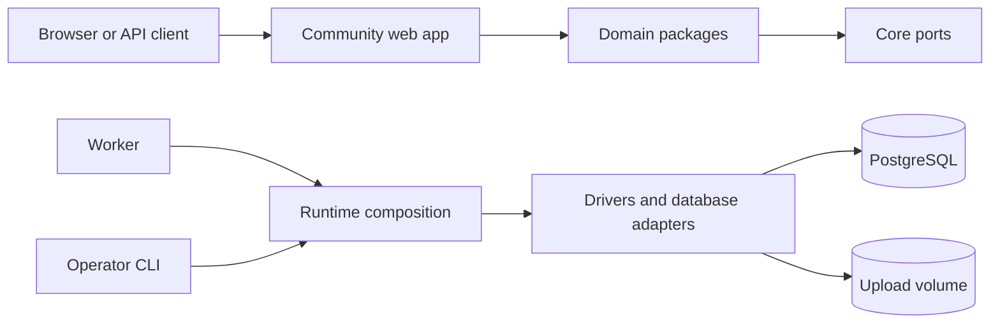

# Architecture

This guide explains how Meith is divided, how requests move through it, and where new behavior belongs. It is for contributors changing more than one package.

For setup, read [Development](./development.md). For framework conventions, read [Next.js conventions](./nextjs-conventions.md).

## System overview

A production board uses PostgreSQL and three application roles:

The Docker Compose deployment adds a one-shot migration service. It finishes before web and worker start. The worker then runs registered tasks on a one-minute loop.

## Applications

| Application | Responsibility |
|---|---|
| `apps/community` | Next.js forum UI, Server Actions, route handlers, and request composition |
| `apps/worker` | Scheduled and queued work outside request handling |
| `apps/cli` | Migrations, backup and restore, imports, users, settings, and maintenance |
| `apps/web` | The marketing and documentation website |

Applications are composition roots. They connect framework input to domain operations and concrete infrastructure. Packages never import application internals.

## Package layers

### Core

`@meith/core` is the bottom of the graph. It defines shared types, errors, environment parsing, permissions, cache keys, and infrastructure ports. It cannot depend on sibling packages.

### Domain packages

Packages such as `@meith/forums`, `@meith/threads`, `@meith/posts`, `@meith/accounts`, and `@meith/moderation` implement business behavior.

Domain packages:

- accept values and port interfaces as inputs;
- return domain values or typed errors;
- do not import Next.js, React, database clients, `@meith/db`, or `@meith/drivers`;
- run against PostgreSQL adapters, fixture repositories, or test doubles.

The domain package list comes from `scripts/domain-packages.cjs`. Dependency Cruiser applies the rules to that list.

### Infrastructure

`@meith/db` is the only package that talks directly to PostgreSQL. `@meith/drivers` selects queue, cache, file, mail, and image implementations from the environment.

`@meith/runtime` builds shared bundles used by the web app, worker, and CLI. This keeps task and repository registration consistent across entrypoints.

### Presentation and extensions

`@meith/ui` contains presentation components and does not fetch data. Themes render documented slots and cannot import domain or infrastructure packages. Plugins use `@meith/plugin-kit`; they cannot import domain packages, drivers, or the database directly.

These are enforced boundaries, not naming conventions. `.dependency-cruiser.cjs` rejects violations.

## Request flow

A typical mutation follows this path:

1. A page or form in `apps/community` receives browser input.
2. Application code parses and validates the input.
3. It resolves the signed-in member and permission context.
4. It calls a domain operation with explicit values and repository interfaces.
5. A PostgreSQL adapter performs the durable work.
6. Application code invalidates the relevant cache tags or refreshes uncached data.
7. The action returns success or a safe typed error.

Reads follow the same boundary in reverse. Application code asks repositories for authorized data and passes view models to the active theme.

Authorization happens before data is exposed. Pages, search, feeds, and API routes use the same audience and permission concepts.

## Data sources

Meith supports two data sources:

- `fixture` provides a deterministic in-memory board for local browsing and tests.
- `postgres` uses production repositories and requires `DATABASE_URL`.

The worker refuses to start in fixture mode because background work must be durable. Production Compose selects PostgreSQL for migration, web, and worker roles.

`getDb()` and `createIsolatedDb()` patch postgres.js's internal per-OID serializer table so `Date` values bind through drizzle's timestamp columns as ISO strings. That reach goes through an internal `options.serializers` map postgres.js does not expose as a stable API, so a future patch release could rename or restructure it and silently break date binding across every repository. `packages/db/src/client.pg.test.ts` carries a round-trip test against a real Postgres server specifically to catch that.

## Background work

`apps/worker` loads the runtime task bundle and calls the scheduler every 60 seconds. Tasks claim work through repositories so retries and overlapping ticks do not process the same item twice.

A stopped worker does not usually crash the web process. Instead, queued mail and scheduled work stop progressing. Operations must monitor both roles.

## Caching and scale

One web instance can use process-local caching. Multiple web instances require a shared Redis-compatible cache so invalidation reaches every process. PostgreSQL remains the source of truth.

See [Scaling out](./scaling.md) for the supported setup.

## Themes

A theme receives a named slot and view model. It controls presentation, not data access or authorization. The registry generates [Theme slots and view models](./theme-slots.md), and slot checks verify implementations against the contract.

## Plugins

Plugins register typed hooks through `@meith/plugin-kit`. The host isolates hook failures so one exception does not fail the page handling it. Plugins still cannot bypass application repositories by importing the database.

[Plugin hooks](./plugin-hooks.md) is generated from the current registry.

## REST API

API v1 routes are declared in a registry that generates [REST API v1](./rest-api.md) and `docs/openapi.json`. Route handlers apply authentication, scopes, rate limits, validation, and domain operations before serializing responses.

Run `pnpm api:docs` after changing the registry.

## Enforced boundaries

`pnpm verify` includes the checks that keep this architecture accurate:

- `pnpm depcruise` rejects forbidden imports and cycles.
- workspace and root checks enforce repository shape.
- guard scripts enforce application invariants imports cannot express.
- slot, hook, API, performance, and site-doc checks reject stale references.
- TypeScript, Biome, and Vitest check implementation behavior.

If a change appears to require crossing a boundary, add or extend a port, implement it in infrastructure, and inject it from an application or runtime composition root. Do not make a domain package reach upward.

## Where code belongs

| Change | Location |
|---|---|
| Business rule for one capability | Its domain package |
| Shared type, error, or infrastructure interface | `packages/core` |
| PostgreSQL query or repository | `packages/db` |
| Cache, queue, mail, file, or image implementation | `packages/drivers` |
| Composition shared by web, worker, or CLI | `packages/runtime` |
| Page, action, route handler, or framework adapter | `apps/community` |
| Reusable visual component | `packages/ui` |
| Theme rendering | `themes/` or a theme package |
| Plugin behavior | `plugins/` through `@meith/plugin-kit` |

If two applications need the same business behavior, move the behavior into a package and keep framework wiring in each application.
