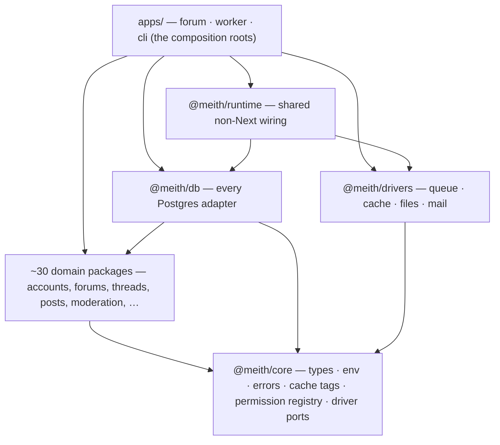
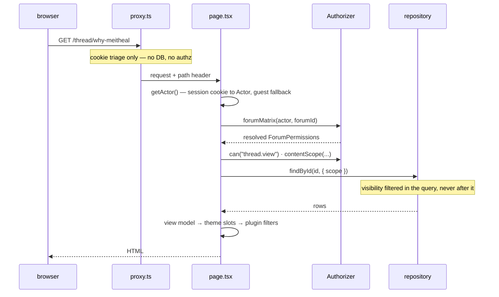
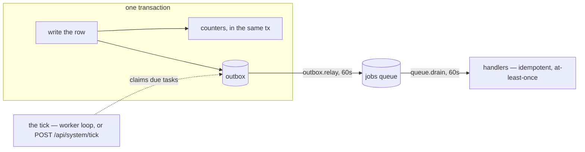

# Architecture

How Meith fits together: the processes it runs as, the layers the code is cut
into, the path a request takes, and the seams — data, themes, plugins — that
everything else hangs off. It is the map for
[working on Meith itself](./development.md); nothing here is needed to run a
board.

Two properties do most of the explaining, and the rest of this document is
largely their consequences:

- **Domain logic is framework-free.** Business rules live in packages that
  import neither Next.js nor a SQL client, behind repository interfaces. That
  is what lets the same code run in a web request, the worker, the CLI and a
  unit test without a database.
- **The boundaries are checked, not trusted.** Every layering rule below is a
  hard error in CI — dependency-cruiser for imports, textual guards for what a
  type cannot see, and a probe for each guard proving it still fires. A
  convention nobody checks is a convention nobody keeps.

## The processes

A running board is one Docker image started three ways — `COMMUNITY_ROLE` picks the
entry in [`docker/entrypoint.sh`](../docker/entrypoint.sh) — plus Postgres:

The compose files ([`docker/compose.yml`](../docker/compose.yml) and the
Coolify variant) wire the dependency order: `migrate` waits for Postgres to be
healthy, `web` and `worker` wait for `migrate` to exit successfully. The
`uploads` volume is shared read-write between web and worker because avatars,
attachments and the board logo go through one file store; CI proves the sharing
by writing a file from one container and reading it from the other.

One deployment deliberately breaks this shape:
[demo mode](./demo-mode.md). Its compose file
([`docker/compose.demo.coolify.yml`](../docker/compose.demo.coolify.yml)) runs
no worker — a `ticker` service drives `POST /api/system/tick` against the web
container instead, because the demo's reset task must clear a cache that lives
in the web server's own process — carries no volumes, and replaces the
`migrate` one-shot with a `seed` that builds the demo board outright.

This shape is why the README calls serverless a non-starter: a board needs a
scheduler that fires every minute (the worker — or a cron hitting
`POST /api/system/tick`), a disk that survives restarts (the volume, or S3),
and a process that outlives a request (the queue drain). The architecture
assumes all three.

The fourth app, `apps/web`, is **meith.dev itself** — the landing page and
these documents. It shares no code with the board: its only coupling to the
rest of the workspace is reading `docs/*.md` and the generated references off
disk at build time. Every page of it is prerendered. It ships as its own image
([`Dockerfile.site`](../docker/Dockerfile.site), a standalone Next.js build) deployed
as a separate resource beside the board
([`docker/compose.site.coolify.yml`](../docker/compose.site.coolify.yml)) — it
holds no data and reads nothing the board writes, and nobody self-hosting a
board needs it.

## The layers

A pnpm workspace: applications in `apps/`, everything else in `packages/`,
`themes/` and `plugins/`. Imports point strictly downward:

The load-bearing rules, each a named `error` in
[`.dependency-cruiser.cjs`](../.dependency-cruiser.cjs):

| Rule | What it forbids |
|---|---|
| `domain-no-next` | A domain package importing `next/*`, `react` or `server-only`. Logic that reaches for `cookies()` cannot run in the worker or the CLI. |
| `domain-no-raw-sql-client` | A domain package importing `postgres`, `pg` or `drizzle-orm`. Only `@meith/db` speaks SQL. |
| `domain-no-infra-impl` | A domain package importing `@meith/db` or `@meith/drivers`. Domain code sees interfaces, never implementations. |
| `core-depends-on-nothing` | `@meith/core` importing any sibling. The graph needs a floor. |
| `no-app-internals-from-packages` | A package reaching back up into `apps/`. |
| `themes-are-presentation-only` | A theme importing the database or domain logic — theming must not be a security surface. |
| `plugins-use-the-kit-only` | A plugin importing anything but `@meith/plugin-kit`. The host isolates failures, not privilege; a plugin with database access can read anything. |
| `ui-is-presentation-only` | `@meith/ui` fetching data. |

`runtime`, `db`, `drivers` — and `demo`, whose seed and reset speak SQL and
run migrations by nature — are deliberately *outside* the protected domain
list; "does this module choose an implementation?" is the question that
decides which side of the line a package sits on.

### The floor: `@meith/core`

Everything imports core; core imports nothing. It holds what every layer must
agree on:

- **One environment reader** — a zod schema in `env.ts`; `assertRuntimeEnv()`
  runs once at process start (`apps/community/instrumentation.ts`), so a bad
  deploy dies at boot rather than 500ing on the first page that reads the
  offending variable.
- **The error taxonomy** — `ValidationError`, `ForbiddenError`,
  `NotFoundError`, `ConflictError`, `RateLimitedError`. Each maps to a status
  and a rendered page; callers key off the types.
- **Cache tags** — every tag name spelled once in `CacheTags`, because a
  writer invalidating `"forum-tree"` while a reader cached under `"forumTree"`
  is stale data no test catches.
- **The permission registry** — `PERMISSION_FIELDS` in `permissions.ts`: 46
  typed fields (27 forum-scoped, 19 global), each with a `kind` that fixes how
  values combine across groups: `boolean` is OR, `numeric` is MAX with `0`
  meaning unlimited, `negative` is AND — a restriction any exempting group
  lifts everywhere.
- **The four driver ports** — `QueueDriver`, `CacheDriver`, `FileStore`,
  `MailDriver`, bundled as `Drivers` in `ports.ts`. These are the only
  infrastructure interfaces core declares.

Repository interfaces are *not* in core. Each lives beside the logic that
consumes it — `ForumRepository` in `@meith/forums`, `TaskRepository` in
`@meith/tasks` — so a package's port and its policy travel together.

### The domain

The middle of the graph is nearly flat: almost every domain package depends on
`@meith/core` alone, with a handful of deliberate edges (`threads` uses
`markdown` and `polls`; `avatars` builds on `attachments`; `signatures`,
`messages` and `notifications` render through `markdown`). In broad strokes:

| Area | Packages | What lives there |
|---|---|---|
| Identity | `accounts`, `groups`, `admin` | Password and token crypto, sessions, bans, group promotion rules, the ACP's second session with its own clocks and IP allowlist. |
| Authorization | `authorization` | The only code that knows how permissions resolve — see [the request path](#a-request-end-to-end). |
| Structure & content | `forums`, `threads`, `posts`, `polls`, `drafts`, `attachments`, `avatars` | The forum tree (materialised paths), thread and reply composers, the post editor, and the rule that an upload is made safe by re-encoding, not by validating. |
| Members | `profile-fields`, `messages`, `relations`, `reputation`, `signatures` | Custom profile fields, private messages, buddy/ignore, ratings, signatures rendered with a deliberately narrower Markdown feature set. |
| Moderation & safety | `moderation`, `antispam` | Approval queue, reports, thread tools and surgery, warnings; rate limits counted in the database, honeypot, question captcha, held first posts. |
| Rendering | `markdown` | The one place member text becomes markup: parse → render, word filter, BBCode migration, URL safety. |
| Delivery | `notifications`, `subscriptions`, `events` | The single "somebody needs to be told" path, thread/forum following, and the transactional outbox. |
| Platform | `settings`, `tasks`, `search`, `api` | The typed settings registry, the scheduled-task contract, the search provider seam, and the REST route registry as data. |
| Lifecycle | `install`, `upgrade`, `import` | The installer's decisions, the upgrade planner, the resumable MyBB import. |

Each package exports services and **ports**; none of them can see how the
ports are implemented.

## The data layer

### `@meith/db`

The single package that speaks to Postgres: `postgres.js` under `drizzle-orm`,
one process-wide lazy client (`getDb()`), and roughly seventy
`Postgres*Repository` classes — one adapter per domain port. Options that are
load-bearing rather than tuning: `prepare: false` (transaction-mode poolers)
and a small pool (`DATABASE_POOL_MAX`, default 3).

Migrations are committed SQL files under `packages/db/migrations/`, ordered by
a drizzle-kit journal — some generated from the schema, many hand-written
because they are data or online-DDL-sensitive. The runner
(`runMigrations()`) takes a session-level advisory lock so concurrent deploys
serialise, and has exactly four callers: `community migrate`, `community upgrade`, the
web installer, and the `COMMUNITY_ROLE=migrate` one-shot container.

Search is Postgres full-text: a `tsvector` column on `posts` (weighted so the
thread's title beats a passing mention), a GIN index, keyset paging on
`(rank, id)`, and a bounded relevance window — measured at 5.5 s unbounded
versus 140 ms bounded on a 2.3M-post board. The column is written on insert
and by a resumable backfill task rather than being `GENERATED`, because adding
a generated column to a large table is an exclusive-lock outage.

### `@meith/drivers`

Implementations of the four core ports, selected by environment:

| Port | Implementations | Selected by |
|---|---|---|
| Queue | `PostgresQueue` (a `jobs` table, `FOR UPDATE SKIP LOCKED`), `MemoryQueue` | `QUEUE_DRIVER` |
| Cache | `NextCacheDriver`, `MemoryCache` | `CACHE_DRIVER` |
| Files | `LocalFileStore`, `S3FileStore` | `FILESTORE_DRIVER` |
| Mail | `ConfiguredMailDriver` → SMTP, HTTP or log | `MAIL_DRIVER`, **or the settings table** |

Mail is the deliberate exception to env-only selection: it is board
configuration an admin edits at runtime, so `ConfiguredMailDriver` resolves
its transport per send — environment first, then the settings table. Demo mode
pins mail to nowhere *before* both, because on a demo the settings table is
written by whoever visited last.
`DATA_SOURCE` does not pick drivers directly; it derives their defaults
(`postgres` implies the Postgres queue and the Next cache, `fixture` implies
memory) and the composition roots pick the repository set.

Every implementation of a port runs the same contract suite from
`@meith/testkit`, under its own name.

### Fixture mode

With no `DATABASE_URL`, `DATA_SOURCE` falls back to `fixture`: in-memory
repositories behind the same interfaces, seeded with a deterministic sample
board. Reads are real; **writes are absent rather than faked** — the
write-side fields of the container are `null`, and the surfaces that need them
say so instead of pretending. Three things depend on this mode: a fresh
checkout runs with nothing installed, `next build` prerenders without a
database (CI and the Docker build both rely on it), and most of the test suite
never touches a socket.

Tests that *are* about SQL semantics get a real engine: PGlite runs the actual
migration files in-process for the unit suite, and serves the Postgres wire
protocol as the database behind the browser tests — plus one suite against a
real server in CI for the places PGlite is too forgiving.

### Three composition roots

There is intentionally no single factory that wires everything for everyone:

- **`apps/community/src/server/container.ts`** — the request path's root, marked
  `server-only`. Branches on `DATA_SOURCE`, builds every repository, and wraps
  `ForumRepository` in its caching decorator in *both* branches, so a caching
  bug shows up in fixture tests too.
- **`apps/cli/src/context.ts`** — the CLI's own root (the container is
  `server-only` and pulls `next/headers`). It shares *policy* instead of
  wiring: `community user:create` reads the board's stored auth settings so a
  CLI-created user satisfies the registration form's rules.
- **`apps/worker/src/index.ts`** — refuses to start unless
  `DATA_SOURCE=postgres`, then loops.

What they share is `buildSchedulerBundle()` from `@meith/runtime` — the one
factory for the task list, its workers and the event handlers, where an absent
dependency means the task is not registered at all, rather than registered and
failing.

## A request, end to end

**`proxy.ts` is not a boundary.** The Edge middleware does cookie-shaped
triage — bounce a cookie-less request to `/login`, send a remember-me cookie
through single-use rotation at `/auth/resume`, mint the opaque cookie that
lets a guest be counted as online — and nothing else. Every page and every
Server Action re-checks authorization itself, because an action is a public
HTTP endpoint whatever rendered the form. The guest cookie is the one thing
the Edge *writes*, and it is minted there because only the middleware can set
a cookie on an ordinary page response; it carries nothing but randomness, no
code path turns it into an actor, and the presence row it stands for is
written by the render, which has the database the Edge does not.

**Authorization is one implementation with no way around it.** The
`Authorizer` answers `can(actor, action, target)` synchronously over resolved
permission sets; resolution (`resolveForumMatrix`) walks the forum's ancestor
chain nearest-first *per group*, then combines across groups by each field's
kind. Content visibility is a `scope` object compiled into the SQL `where`
clause — pages, feeds, search and the REST API all pass through it, which is
what the README means by "no path that reads around the rules".

**Pages assemble, packages decide.** A page resolves params, reads through the
container, builds a JSON-shaped view model in `src/view/`, and hands it to
theme slots. Mutations are Server Actions with one shape: parse the form,
re-check authorization, call a domain command, map domain errors to form
state, redirect outside the `try`.

**The REST API is the same stack, not a sibling.** One catch-all route
(`/api/v1/[...path]`) dispatches through `ROUTES` — a data table in
`@meith/api` of method, path, scope, cost — in a fixed order: match, token,
scope, rate limit, then the same `ActorSource` and `Authorizer` as the pages,
then a handler that calls the same domain command the web form calls.
[`rest-api.md`](./rest-api.md) is generated from that table, and CI fails when
they disagree.

## Background work

Anything that cannot be afforded inside a request leaves it through the
transactional outbox, and everything asynchronous is driven by one scheduler:

**Events are emitted in the transaction that writes the data** — `emit()`
takes the transaction handle explicitly, so a rolled-back write emits nothing.
A relay task drains the outbox onto the jobs queue; handlers are idempotent
without exception, because at-least-once delivery is the contract.

**The tick is a database claim, not a cron expression.** `tick()` runs each
task whose interval has elapsed, claiming it with one conditional `UPDATE` on
the `tasks` table — so any number of instances can tick concurrently and a
task runs once, with a stale-claim timeout for workers that die mid-run. Every
task is written as an idempotent *catch-up* operation ("flush what is
outstanding"), never "run at 03:00", so a missed day is caught up rather than
lost. Nineteen built-in tasks ride this: the outbox relay, queue drain and
instant subscriptions at 60 s, down through digest and sweep work to counter
reconciliation every six hours. Plugin tasks join the same schedule under a
namespaced id. [Demo mode](./demo-mode.md) adjusts the list at both ends:
webhook delivery is never registered — the task does not exist rather than
existing and refusing — and `demo.reset` joins, added in the web container's
composition root rather than `buildSchedulerBundle()`, because that is the
only root whose in-process cache the reset can invalidate.

The tick has two drivers — the worker process (in-process, every 60 s, keeps
running when the web container is down) and the `TICK_SECRET`-guarded HTTP
route for deployments where a cron must do it. Same `tick()`, same claim
semantics, no coordination needed between them. The demo deployment is the
shape that runs on the HTTP driver alone, for the cache-locality reason
above.

## The extension surfaces

Themes and plugins extend the board through two frozen contracts, and neither
can reach past its kit — the dependency rules above make that structural, not
aspirational.

**A theme fills slots.** `@meith/theme-kit` declares 29 named slots as data,
each `server` or `client` — exactly two are client, both editor islands,
because a client `PostBit` would ship every post list to the browser. Slot
props are view models proven JSON-shaped at compile time (`Serialisable<T>`);
no `Date`, no functions, no rows. A slot never renders another slot — the page
resolves both and passes rendered regions in, which is what lets a child theme
override one slot and have it apply everywhere. Themes resolve their
`extends` chain once at boot, and a theme with a missing slot fails the
deployment, not the first request that needed it. The server/client boundary
is enforced three ways: in the types, at `defineTheme()`, and by a textual
check (`pnpm slots:check`) that catches the case the other two cannot — a
synchronous component in a `"use client"` file.

**A plugin declares hooks.** `@meith/plugin-kit` registers 95 hooks — filters
that transform a value, events that notify — with typed payloads. Payloads
carry a `ViewerRef` (an id and a guest flag), never an `Actor`: an `Actor` is
the input to authorization, and handing one over invites the plugin to make
its own permission decisions. No hook exists inside `can()` or the visibility
filter, deliberately. A plugin is a declarative object — settings, SQL
migrations the *host* runs, scheduled tasks, admin pages, HTTP routes and
member-facing pages the host mounts and guards, region contributions,
lifecycle callbacks — validated at `definePlugin()`. At runtime it is handed
narrow capabilities rather than infrastructure: its own prefixed tables,
timed membership grants in operator-approved groups, and member lookup by
name — each host-implemented, each refusing what a plugin must not do. Failure
containment is one `try/catch` around every handler call: a throwing filter
keeps the previous value, five failures auto-disable the plugin for that
instance, and there are deliberately no timeouts — JavaScript cannot abort a
running handler, so a "timeout" would return control while the handler keeps
its database connection. Slow calls are measured and logged instead.

Plugin hooks and domain events are different systems that share some names:
a hook is synchronous, in-request, best-effort; a domain event is durable
work through the outbox. The app fires both — the hook after the commit, so a
plugin is never told about a thread that may still roll back.

Both registries generate their references — [`theme-slots.md`](./theme-slots.md)
and [`plugin-hooks.md`](./plugin-hooks.md) — and `pnpm verify` fails when
either drifts from the code. The policy documents are
[the theme API](./theme-api.md) and [the plugin API](./plugin-api.md).

## One more renderer

There are two Markdown pipelines in the repository, and they are deliberately
not one. `packages/markdown` renders *member* text inside the board — it
constructs safe HTML rather than sanitising it, applies the word filter, and
exposes narrower feature sets for signatures. The docs site has its own
build-time renderer in `apps/web` for *repository* text — these documents —
with build-time syntax highlighting and the diagrams on this page. Member
input and repository prose have different threat models and different feature
needs; sharing a renderer would force one to carry the other's rules.

## What keeps the shape honest

The architecture survives contact with contributors because `pnpm verify`
checks it mechanically: dependency-cruiser for every arrow in the layer
diagram, textual guards (each with a probe proving it still fires) for the
invariants a type cannot express, the slot-boundary check, a check that every
declared hook has a call site, and staleness checks for every generated
reference — including the manifest that publishes these documents. The browser
suite holds the same line at runtime: a reporter reads the dev server's output
and fails the run on any unhandled server error, however many tests passed.
The full list, with what each gate catches, is in
[Development](./development.md#the-scripts-that-fail-on-purpose).

## Where to read next

| You want | Read |
|---|---|
| To run it on your machine | [Development](./development.md) |
| The per-PR conventions behind these boundaries | [Next.js conventions](./nextjs-conventions.md) |
| To write a theme | [The theme API](./theme-api.md) |
| To write a plugin | [The plugin API](./plugin-api.md) |
| The deployment shapes in detail | [Deploying by hand](./self-hosting.md) |
| The board that resets itself | [Demo mode](./demo-mode.md) |
