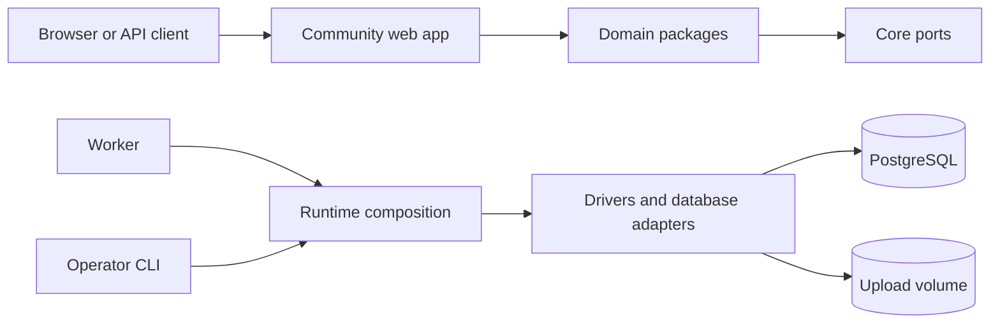

# Architecture

This guide explains how Meith is divided, how requests move through it, and where new behavior belongs. It is for contributors changing more than one package.

For setup, read [Development](../contributing/development.md). For framework conventions, read [Next.js conventions](../contributing/nextjs-conventions.md).

## System overview

A production board uses PostgreSQL and three application roles:

The Docker Compose deployment adds a one-shot migration service. It finishes before web and worker start. The worker then runs registered tasks on a one-minute loop.

## Applications

| Application | Responsibility |
|---|---|
| `apps/community` | Next.js forum UI, Server Actions, route handlers, and request composition |
| `apps/worker` | Scheduled and queued work outside request handling |
| `apps/cli` | Migrations, backup and restore, imports, users, settings, and maintenance |
| `apps/web` | The marketing and documentation website |

Applications are composition roots. They connect framework input to domain operations and concrete infrastructure. Packages never import application internals.

## The stock board

`boards/stock` is a second board — a create-meith-shaped workspace, with its own `package.json` (`workspace:*` dependencies on `@meith/web` and `@meith/cli`, plus whatever it imports directly), `community.config.ts`, `board.plugins.json` and generated `community.plugins.ts` — that reproduces exactly what `apps/community`'s own board config declares: the default theme, the same env-gated showcase themes, and the same env-gated demo/test plugin spreading. `docker/Dockerfile` builds the official image from this workspace, through `forum-web build`, rather than building `apps/community` directly. That is the whole point: the image ships built from the *same workspace shape* every custom board has, so graduating from it to a custom board is a source swap, not a migration.

`apps/community` stays the framework package and the in-repo dev target — `pnpm dev` is unchanged, and still runs `apps/community` in place, not through `forum-web`. The two board configs are a deliberate, documented duplication rather than one board definition, because `forum-web`'s materialization (below) copies the app's sources into `.meith/app/` *once*, before the dev server starts; a `boards/stock` dev loop would watch and hot-reload those copies, not `apps/community`'s own sources, so it cannot replace `pnpm dev`'s fixture-mode, hot-reloading loop without another change to that mechanism. Follow-up work, not part of this.

Building `boards/stock` inside this monorepo's own (non-hoisted) pnpm install — rather than a real external board's hoisted `node_modules` — needs two things a genuine external board never does, both handled by `boards/stock/package.json`'s own `build`/`dev` scripts:

- **`FORUM_WORKSPACE_ROOT`**, read by `apps/community/next.config.mjs`, points `outputFileTracingRoot` and `turbopack.root` at this repository's own root rather than at `boards/stock` itself — the default two-directories-up-from-itself computation, correct for a hoisted external board, lands on `boards/stock` instead, which does not contain the pnpm store `next` and every other real dependency actually resolve through. `apps/community/bin/forum-web.mjs` also uses it during materialization to rewrite `src/styles/globals.css`'s Tailwind `@source` scan roots (`themes/`, `plugins/`, `examples/`, `packages/ui/src`) against it, keeping them resolvable at `boards/stock`'s extra materialization depth. That rewrite runs on every materialization, against whatever workspace root is in effect rather than only when this variable is set, and it asks whether each scan root is really there. Inside this repository they all are, so `boards/stock` and `pnpm dev` get the same directories they always did. A real external board has none of them — that code arrives under `node_modules/@meith` — and the rewrite substitutes that one directory for the four that are missing. It has to: Tailwind treats a scan root that resolves to nothing as no error at all, builds green, and emits no utility for anything it could not read, so before MEI-131 every scaffolded board served a stylesheet with the preflight in it and nothing else.
- **`FORUM_ALIASES_FROM`**, read by `apps/community/bin/forum-web.mjs`, points at this repository's own `tsconfig.base.json` so the materialized app's generated tsconfig also carries every `@meith/*` alias apps/community's own tsconfig hand-maintains — packages here resolve each other through those aliases straight to source, not through real `dependencies` entries (see "Package layers" below), which plain node_modules resolution alone cannot see.

Neither changes anything for `forum-web`/`community` used the way `docs/contributing/development.md`, "Consuming the board from a workspace" describes — a real external board sets neither itself, and `FORUM_WORKSPACE_ROOT` unset simply means `forum-web` passes the invoking workspace's own root onward in its place. `boards/stock/package.json`'s own scripts write both relative to the board's own directory, which is that process's cwd — but `next dev|build` runs with `.meith/app` as its own cwd instead, so `apps/community/bin/forum-web.mjs` rewrites both to absolute paths before spawning, before `next.config.mjs` or `monorepoAliases()` ever resolve them, so both mean the same thing regardless of which process reads them.

### The image's CLI build

`docker/Dockerfile` builds the web app from `boards/stock` (above), but the operator CLI (`apps/cli`) ships no Next app and no `forum-web`-style bin of its own for building — its `build` script is a plain `esbuild --bundle` over `apps/cli/src/index.ts`. esbuild auto-discovers a tsconfig by walking up from the entry file's own directory, which finds this repository's root `tsconfig.json` (extending `tsconfig.base.json`) long before it would ever reach `boards/stock` — and that tsconfig's `@board/*` aliases point at `apps/community`. Built that way, the image's CLI would resolve `@board/plugins` (`apps/cli/src/index.ts`'s `community upgrade` and `community plugin:purge`) against `apps/community`'s plugin registry while the image's web app, built just above from `boards/stock`, serves `boards/stock`'s — two different plugin lists compiled into the one image, invisible unless the two boards' plugin manifests ever diverge (`tests/boards-stock.test.ts` currently keeps them byte-equal, but `scripts/board-plugins-gen.mjs` generates them independently, by design, so nothing stops a future edit that only touches one).

`pnpm board:cli-tsconfig` (`scripts/board-cli-tsconfig.mjs`) fixes this the same way `FORUM_ALIASES_FROM` fixes the equivalent problem for the web build: it reads `tsconfig.base.json`'s own `paths`, keeps every alias except `@board/*`, and writes a throwaway tsconfig — `boards/stock/.meith/tsconfig.cli.json`, gitignored under the same `.meith/` pattern `forum-web`/`community` materialize into, regenerated on every build — with `@board/config` and `@board/plugins` pointed at `boards/stock`'s own `community.config.ts` / `community.plugins.ts` instead. `docker/Dockerfile` runs this generator immediately before the CLI build and passes the result to esbuild's own `--tsconfig` flag, which esbuild uses in place of whatever it would have auto-discovered. `pnpm --filter @meith/cli build` (no flag), `pnpm community` (`apps/cli`'s `start`/`dev` scripts, run via `tsx`), and `pnpm dev` are all unaffected — this only changes what the Docker image's own build stage points the seam at.

## The board-config seam

A board's installed themes and plugins are declared in its own `community.config.ts` and `community.plugins.ts` — `apps/community`'s own pair for the in-repo dev target, `boards/stock`'s own pair for the workspace the official image is built from. Each `community.plugins.ts` also pulls in its own `community.demo.plugins.ts`, the hand-written escape hatch `docs/customization/plugins.md` describes — part of the same board, not a separate seam. `apps/cli`, `e2e/support/demo-board.ts`, and `apps/community` itself reach *their own* board-config files through one named boundary — the `@board/config` and `@board/plugins` tsconfig path aliases, defined identically in `tsconfig.base.json` and `apps/community/tsconfig.json` — never through a relative path into `apps/community`, at any depth or through any intermediate directory. Node's own subpath-imports field (`#specifier` in `package.json`) cannot express this seam: its targets may not resolve outside the declaring package, and `apps/cli` reaching into `apps/community` is exactly that. A tsconfig path alias has no such restriction and is already how every `@meith/*` package is resolved, so `@board/*` follows the same convention.

`scripts/guards.config.mjs`'s `no-relative-board-config-import` guard fails the build on a new relative import of any of the three files from outside their own definition, so the boundary cannot silently erode back to a relative path — including one that reaches `apps/community` through a named directory segment such as `apps/` or `boards/stock/`, not only through a run of `./` and `../`. The board files may still import each other by relative path — that is the seam's own definition, not a caller reaching around it. `packages/create-meith/src/scaffold.ts` is allowed for a different reason: its match is template text for an *external* workspace's own `community.config.ts`, relative to that workspace's own `community.plugins.ts` — the seam this guard protects is `apps/community`'s (and `boards/stock`'s in-repo copy), not a scaffolded board's.

Naming board config through one alias, rather than a relative path that assumes `apps/community`'s location, is what would let a board's configuration move into its own workspace later without changing every file that reads it.

## Package layers

### Core

`@meith/core` is the bottom of the graph. It defines shared types, errors, environment parsing, permissions, cache keys, and infrastructure ports. It cannot depend on sibling packages.

### Domain packages

Packages such as `@meith/forums`, `@meith/threads`, `@meith/posts`, `@meith/accounts`, and `@meith/moderation` implement business behavior.

Domain packages:

- accept values and port interfaces as inputs;
- return domain values or typed errors;
- do not import Next.js, React, database clients, `@meith/db`, or `@meith/drivers`;
- run against PostgreSQL adapters, fixture repositories, or test doubles.

The domain package list comes from `scripts/domain-packages.cjs`. Dependency Cruiser applies the rules to that list.

### Infrastructure

`@meith/db` is the only package that talks directly to PostgreSQL. `@meith/drivers` selects queue, cache, file, mail, and image implementations from the environment.

`@meith/runtime` builds shared bundles used by the web app, worker, and CLI. This keeps task and repository registration consistent across entrypoints.

### Presentation and extensions

`@meith/ui` contains presentation components and does not fetch data. Themes render documented slots and cannot import domain or infrastructure packages. Plugins use `@meith/plugin-kit`; they cannot import domain packages, drivers, or the database directly.

These are enforced boundaries, not naming conventions. `.dependency-cruiser.cjs` rejects violations.

## Request flow

A typical mutation follows this path:

1. A page or form in `apps/community` receives browser input.
2. Application code parses and validates the input.
3. It resolves the signed-in member and permission context.
4. It calls a domain operation with explicit values and repository interfaces.
5. A PostgreSQL adapter performs the durable work.
6. Application code invalidates the relevant cache tags or refreshes uncached data.
7. The action returns success or a safe typed error.

Reads follow the same boundary in reverse. Application code asks repositories for authorized data and passes view models to the active theme.

Authorization happens before data is exposed. Pages, search, feeds, and API routes use the same audience and permission concepts.

## Data sources

Meith supports two data sources:

- `fixture` provides a deterministic in-memory board for local browsing and tests.
- `postgres` uses production repositories and requires `DATABASE_URL`.

The worker refuses to start in fixture mode because background work must be durable. Production Compose selects PostgreSQL for migration, web, and worker roles.

`getDb()` and `createIsolatedDb()` patch postgres.js's internal per-OID serializer table so `Date` values bind through drizzle's timestamp columns as ISO strings. That reach goes through an internal `options.serializers` map postgres.js does not expose as a stable API, so a future patch release could rename or restructure it and silently break date binding across every repository. `packages/db/src/client.pg.test.ts` carries a round-trip test against a real Postgres server specifically to catch that.

## Background work

`apps/worker` loads the runtime task bundle and calls the scheduler every 60 seconds. Tasks claim work through repositories so retries and overlapping ticks do not process the same item twice. Where there is no long-lived process to run that loop, `/api/system/tick` runs exactly one tick over HTTP and a cron scheduler calls it instead — see [Monitoring](../guides/operations/monitoring.md#driving-the-tick-over-http).

Every task caps the work it takes on in a single tick, so the cost of one tick is bounded by that cap rather than by how far behind the board has fallen: what a task does not reach is left for the next tick. A task that walks the whole membership or the whole post table does it a page at a time across successive ticks, resuming from a stored cursor, rather than scanning the table in one run.

A stopped worker does not usually crash the web process. Instead, queued mail and scheduled work stop progressing. Operations must monitor both roles.

## Caching and scale

One web instance can use process-local caching. Multiple web instances require a shared Redis-compatible cache so invalidation reaches every process. PostgreSQL remains the source of truth.

See [Scaling out](../guides/operations/scaling.md) for the supported setup.

## Themes

A theme receives a named slot and view model. It controls presentation, not data access or authorization. The registry generates [Theme slots and view models](./theme-slots.md), and slot checks verify implementations against the contract.

## Plugins

Plugins register typed hooks through `@meith/plugin-kit`. The host isolates hook failures so one exception does not fail the page handling it. Plugins still cannot bypass application repositories by importing the database.

[Plugin hooks](./plugin-hooks.md) is generated from the current registry.

## REST API

API v1 routes are declared in a registry that generates [REST API v1](./api.md) and `docs/reference/openapi.json`. Route handlers apply authentication, scopes, rate limits, validation, and domain operations before serializing responses.

Run `pnpm api:docs` after changing the registry.

## Enforced boundaries

`pnpm verify` includes the checks that keep this architecture accurate:

- `pnpm depcruise` rejects forbidden imports and cycles.
- workspace and root checks enforce repository shape.
- guard scripts enforce application invariants imports cannot express.
- slot, hook, API, performance, and site-doc checks reject stale references.
- TypeScript, Biome, and Vitest check implementation behavior.

If a change appears to require crossing a boundary, add or extend a port, implement it in infrastructure, and inject it from an application or runtime composition root. Do not make a domain package reach upward.

## Where code belongs

| Change | Location |
|---|---|
| Business rule for one capability | Its domain package |
| Shared type, error, or infrastructure interface | `packages/core` |
| PostgreSQL query or repository | `packages/db` |
| Cache, queue, mail, file, or image implementation | `packages/drivers` |
| Composition shared by web, worker, or CLI | `packages/runtime` |
| Page, action, route handler, or framework adapter | `apps/community` |
| Reusable visual component | `packages/ui` |
| Theme rendering | `themes/` or a theme package |
| Plugin behavior | `plugins/` through `@meith/plugin-kit` |

If two applications need the same business behavior, move the behavior into a package and keep framework wiring in each application.
