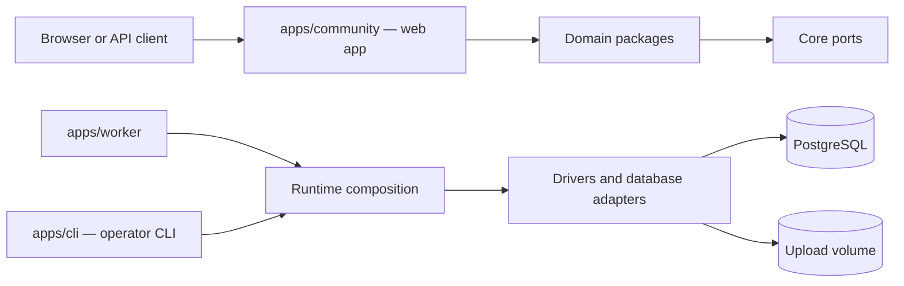

# Architecture

How Meith is divided, how a request moves through it, and where new behavior
belongs. It is for contributors changing more than one package. For setup,
read [Development](../contributing/development.md); for framework
conventions, [Next.js conventions](../contributing/nextjs-conventions.md).

## System overview

A production board is PostgreSQL plus three application roles, and the
Docker Compose deployment adds a one-shot `migrate` service that finishes
before web and worker start:

| Application | Responsibility |
|---|---|
| `apps/community` | Next.js forum UI, Server Actions, route handlers, and request composition |
| `apps/worker` | Scheduled and queued work outside request handling |
| `apps/cli` | Migrations, backup and restore, imports, users, settings, and maintenance |
| `apps/web` | The marketing and documentation website, meith.dev |

Applications are composition roots: they connect framework input to domain
operations and concrete infrastructure. Packages never import application
internals.

## The stock board

`boards/stock` is a second board inside this repository: a
create-meith-shaped workspace with its own `package.json` (depending on
`@meith/web` and `@meith/cli`), `meith.config.ts`, `board.plugins.json`
and generated `meith.plugins.ts`, declaring the same themes and plugins as
`apps/community`'s own board config. `docker/Dockerfile` builds the
official image from this workspace, through `forum-web build`, rather than
from `apps/community` directly. That is the point: the image ships from the
same workspace shape every custom board has, so graduating from the stock
board to a custom one is a source swap, not a migration.

`apps/community` stays the framework package and the in-repo dev target:
`pnpm dev` runs it in place, hot-reloading, with no `forum-web` step. The
two board configs are deliberate duplication rather than one shared
definition — `forum-web` copies the app's sources into `.meith/app/` once,
before the dev server starts, so a `boards/stock` dev loop would watch
those copies rather than `apps/community`'s sources.
`tests/boards-stock.test.ts` keeps the two plugin manifests identical.

Building `boards/stock` inside this repository's non-hoisted pnpm install
needs two environment variables a real external board never sets, both
written by `boards/stock/package.json`'s own scripts:

- **`FORUM_WORKSPACE_ROOT`** points the workspace-root computation in
  `apps/community/next.config.mjs` (`outputFileTracingRoot`,
  `turbopack.root`, and the Tailwind `@source` rebasing `forum-web` does at
  materialization) at this repository's root. The default — two directories
  up from the materialized app, correct for a hoisted external board — would
  land on `boards/stock` itself, which holds none of the real dependencies.
- **`FORUM_ALIASES_FROM`** points at the root `tsconfig.base.json`, so the
  materialized app's generated tsconfig carries the `@meith/*` path aliases
  through which packages here resolve each other straight to source (see
  "Package layers" below) — plain `node_modules` resolution cannot see them.

The image's operator CLI needs one extra step for the same underlying
reason. `apps/cli`'s build is a plain `esbuild --bundle`, and esbuild would
auto-discover the repository's root tsconfig — whose `@board/*` aliases
point at `apps/community`, not `boards/stock`. `pnpm board:cli-tsconfig`
writes a throwaway tsconfig (`boards/stock/.meith/tsconfig.cli.json`) with
`@board/config` and `@board/plugins` pointed at `boards/stock`'s own files,
and `docker/Dockerfile` passes it to esbuild's `--tsconfig` — so the
image's CLI and web app agree on which board they were built from. No other
build is affected.

What `forum-web` and `meith` do for a genuine external board is
[Consuming the board from a workspace](../contributing/development.md#consuming-the-board-from-a-workspace).

## The board-config seam

A board's installed themes and plugins are declared in its own
`meith.config.ts` and `meith.plugins.ts` — plus the hand-written
`meith.demo.plugins.ts` each pulls in ([Plugins](../customization/plugins.md)
describes it). Everything in this repository that reads them —
`apps/community` itself, `apps/cli`, `e2e/support/demo-board.ts` — reaches
its own board's files through one named boundary: the `@board/config` and
`@board/plugins` tsconfig path aliases, defined identically in
`tsconfig.base.json` and `apps/community/tsconfig.json`. Never through a
relative path into `apps/community`.

The seam is a tsconfig path alias rather than a Node subpath import because
a subpath import's target may not resolve outside the declaring package —
and `apps/cli` reaching a board's config is exactly that. Naming the config
through one alias is also what lets `forum-web` and `meith` repoint the
seam at an external workspace's own files, and what lets the image build
point it at `boards/stock`, without touching any file that reads it.

The `no-relative-board-config-import` guard in `scripts/guards.config.mjs`
fails the build on a new relative import of a board-config file from
outside the board's own files, so the boundary cannot quietly erode back
into a path that assumes `apps/community`'s location. (The board files may
import each other relatively — that is the seam's own definition — and
`packages/create-meith`'s scaffold is exempt because its matches are
template text for an external workspace's own files.)

## Package layers

### Core

`@meith/core` is the bottom of the graph. It defines shared types, errors,
environment parsing, permissions, cache keys, and infrastructure ports. It
cannot depend on sibling packages.

### Domain packages

Packages such as `@meith/forums`, `@meith/threads`, `@meith/posts`,
`@meith/accounts`, and `@meith/moderation` implement business behavior.

Domain packages:

- accept values and port interfaces as inputs;
- return domain values or typed errors;
- do not import Next.js, React, database clients, `@meith/db`, or
  `@meith/drivers`;
- run against PostgreSQL adapters, fixture repositories, or test doubles.

The domain package list comes from `scripts/domain-packages.cjs` — every
directory under `packages/` not named in its infrastructure set — and
Dependency Cruiser applies the rules to that list.

### Infrastructure

`@meith/db` is the only package that talks directly to PostgreSQL.
`@meith/drivers` selects queue, cache, file, mail, and image
implementations from the environment.

`@meith/runtime` builds shared bundles used by the web app, worker, and
CLI. This keeps task and repository registration consistent across
entrypoints.

### Presentation and extensions

`@meith/ui` contains presentation components and does not fetch data.
Themes render documented slots and cannot import domain or infrastructure
packages. Plugins use `@meith/plugin-kit`; they cannot import domain
packages, drivers, or the database directly.

These are enforced boundaries, not naming conventions.
`.dependency-cruiser.cjs` rejects violations.

## Request flow

A typical mutation follows this path:

1. A page or form in `apps/community` receives browser input.
2. Application code parses and validates the input.
3. It resolves the signed-in member and permission context.
4. It calls a domain operation with explicit values and repository
   interfaces.
5. A PostgreSQL adapter performs the durable work.
6. Application code invalidates the relevant cache tags or refreshes
   uncached data.
7. The action returns success or a safe typed error.

Reads follow the same boundary in reverse: application code asks
repositories for authorized data and passes view models to the active
theme.

Authorization happens before data is exposed. Pages, search, feeds, and API
routes use the same audience and permission concepts.

## Data sources

Meith supports two data sources:

- `fixture` provides a deterministic in-memory board for local browsing and
  tests.
- `postgres` uses production repositories and requires `DATABASE_URL`.

The worker refuses to start in fixture mode because background work must be
durable. Production Compose selects PostgreSQL for the migrate, web, and
worker roles.

`getDb()` and `createIsolatedDb()` patch postgres.js's internal per-OID
serializer table so `Date` values bind through drizzle's timestamp columns
as ISO strings. That `options.serializers` map is not a stable API, so a
postgres.js patch release could restructure it and silently break date
binding; `packages/db/src/client.pg.test.ts` round-trips against a real
Postgres server specifically to catch that.

## Background work

`apps/worker` loads the runtime task bundle and calls the scheduler every
60 seconds. Tasks claim work through repositories so retries and
overlapping ticks do not process the same item twice. Where there is no
long-lived process to run that loop, `/api/system/tick` runs exactly one
tick over HTTP and a cron scheduler calls it instead — see
[Monitoring](../guides/operations/monitoring.md#driving-the-tick-over-http).

Every task caps the work it takes in a single tick, so a tick's cost is
bounded by the cap rather than by how far behind the board has fallen. A
task that walks the whole membership or post table does it a page at a
time across ticks, resuming from a stored cursor.

A stopped worker does not usually crash the web process; queued mail and
scheduled work stop progressing instead. Operations must monitor both
roles.

## Caching and scale

One web instance can use process-local caching. Multiple web instances
require a shared Redis-compatible cache so invalidation reaches every
process. PostgreSQL remains the source of truth. See
[Scaling out](../guides/operations/scaling.md) for the supported setup.

## Themes

A theme receives a named slot and view model. It controls presentation, not
data access or authorization. The registry generates
[Theme slots and view models](./theme-slots.md), and slot checks verify
implementations against the contract.

## Plugins

Plugins register typed hooks through `@meith/plugin-kit`. The host isolates
hook failures so one exception does not fail the page handling it. Plugins
still cannot bypass application repositories by importing the database.

[Plugin hooks](./plugin-hooks.md) is generated from the current registry.

## REST API

API v1 routes are declared in a registry that generates
[REST API v1](./api.md) and `docs/reference/openapi.json`. Route handlers
apply authentication, scopes, rate limits, validation, and domain
operations before serializing responses. Run `pnpm api:docs` after changing
the registry.

## Enforced boundaries

`pnpm verify` includes the checks that keep this architecture accurate:

- `pnpm depcruise` rejects forbidden imports and cycles.
- workspace and root checks enforce repository shape.
- guard scripts enforce application invariants imports cannot express.
- slot, hook, API, performance, and site-doc checks reject stale
  references.
- TypeScript, Biome, and Vitest check implementation behavior.

If a change appears to require crossing a boundary, add or extend a port,
implement it in infrastructure, and inject it from an application or
runtime composition root. Do not make a domain package reach upward.

## Where code belongs

| Change | Location |
|---|---|
| Business rule for one capability | Its domain package |
| Shared type, error, or infrastructure interface | `packages/core` |
| PostgreSQL query or repository | `packages/db` |
| Cache, queue, mail, file, or image implementation | `packages/drivers` |
| Composition shared by web, worker, or CLI | `packages/runtime` |
| Page, action, route handler, or framework adapter | `apps/community` |
| Reusable visual component | `packages/ui` |
| Theme rendering | `themes/` or a theme package |
| Plugin behavior | `plugins/` through `@meith/plugin-kit` |

If two applications need the same business behavior, move the behavior into
a package and keep framework wiring in each application.
